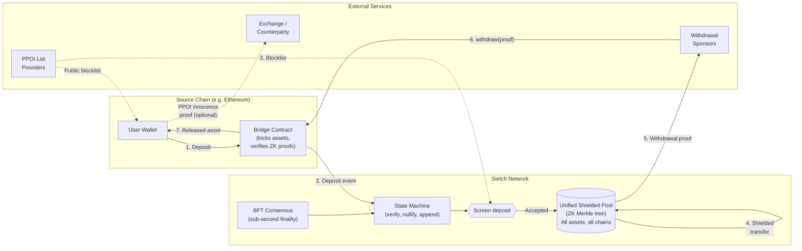
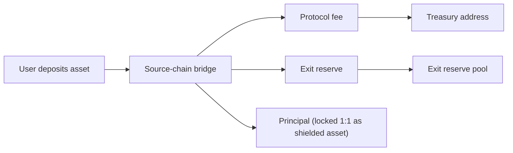

# Sietch: A Privacy-First Payment Network

> **Version:** 0.4.2
> **Date:** April 2026
> **Status:** Phase 0 complete; devnet operational; testnet in active development

## Table of Contents

- [1. Executive Summary](#1-executive-summary)
- [2. Problem and Scope](#2-problem-and-scope)
- [3. System Overview](#3-system-overview)
- [4. Architecture](#4-architecture)
- [5. Threat Model and Security](#5-threat-model-and-security)
  - [5.1 Post-Quantum Cryptography](#51-post-quantum-cryptography)
- [6. Token and Economics](#6-token-and-economics)
- [7. Governance and Upgrades](#7-governance-and-upgrades)
- [8. Roadmap](#8-roadmap)
- [9. Risks and Limitations](#9-risks-and-limitations)
- [10. References, Audits, and Reproducibility](#10-references-audits-and-reproducibility)
- [Glossary](#glossary)
- [Disclaimer](#disclaimer)

---

## 1. Executive Summary

Sietch is a privacy-preserving payment network designed to shield transactions across multiple public blockchains. A typical use case for users:

1. Deposit assets into a non-custodial bridge contract on a supported source chain.
2. Receive a shielded representation of that asset inside the Sietch network (e.g., `pETH`).
3. Transfer privately.
4. Withdraw to any address on the source chain.

Sender identity, receiver identity, and transaction amounts are hidden by zero-knowledge proofs throughout the entire lifecycle.

The network operates as an independent Layer 1 with its own BFT consensus, providing sub-second finality for shielded transfers without source-chain gas costs. On-chain ZK verification on the source chain secures all withdrawals: the bridge contract releases funds only upon verification of a valid cryptographic proof. The ZK circuits use the Hermez Perpetual Powers of Tau structured reference string -- a widely audited multi-party computation ceremony where soundness holds if at least one of the hundreds of independent contributors was honest.

The protocol is designed to support multiple assets across multiple chains. Each supported asset is paired with a dedicated bridge contract on its source chain. The note structure includes an `asset_id` field from inception, enabling the same ZK circuits, shielded pool, and wallet infrastructure to handle additional assets without circuit redesign. The initial implementation targets **Ethereum, with ETH as the first supported asset** (shielded as `pETH`). Additional assets -- including BTC, BNB, USDT, USDC, SOL, and XRP -- are planned for subsequent phases, each requiring a chain-specific bridge contract and watcher but sharing the core Sietch privacy layer.

Compliance is handled through Private Proofs of Innocence (PPOI), a mechanism adapted from prior work in the privacy protocol space. PPOI allows users to demonstrate that their funds are not linked to known illicit activity, without revealing their identity. Exchanges and counterparties can verify these proofs programmatically.

The protocol is governed by the `SIETCH` token (570,000,000 total supply), which serves three functions: collateral for validator participation in consensus, on-chain governance voting, and validator compensation for computational work. Users do not need SIETCH to send, receive, or withdraw private payments; they interact with shielded assets (pETH, pBTC, pBNB, etc.) only.

**Phase 0 (proof of concept) is complete.** The Sietch devnet is live and operational: all ZK circuits, proof generation, on-chain verification, and bridge operations run with **production-equivalent** logic. Nothing is mocked or simulated. The project is now in active testnet development, with a detailed security audit targeted for early 2027.

> **Note on trusted setup alternatives:** The team is actively evaluating STARK-based proof systems as a path to eliminating the trusted setup requirement entirely. A STARK-based proving backend would be adopted if and only if the resulting EVM verifier gas cost is competitive with the current KZG/BN254 approach. Until that bar is met, the Hermez Perpetual Powers of Tau SRS remains the production configuration.

---

## 2. Problem and Scope

### The problem

Transactions on public blockchains expose the sender address, receiver address, and amount to anyone with access to a block explorer. This is true across Ethereum, Bitcoin, BNB Chain, Solana, and every other major public ledger. For individuals and businesses that require basic financial privacy, this transparency is a structural barrier to using cryptocurrency for everyday payments.

The demand for privacy in crypto transactions is substantial and growing. As of early 2026, privacy-focused crypto assets represent an estimated $24-34 billion in market capitalization, with annual transaction volumes exceeding $250 billion and their share of total crypto transactions rising from 9.7% in 2024 to 11.4% [CIT-01].

Existing solutions leave gaps:


| Approach                                  | Gap                                                                                                  |
| ----------------------------------------- | ---------------------------------------------------------------------------------------------------- |
| On-chain privacy contracts (e.g. RAILGUN) | Subject to source-chain gas costs; single-chain only; no independent chain economics                 |
| Compliance-mandatory pools (e.g. 0xbow)   | Require identity disclosure through Association Set Providers; privacy is conditional                |
| General-purpose private VMs (e.g. Aztec)  | Broad scope targeting all of DeFi; not optimized for the payment use case                            |
| Privacy coins (Monero, Zcash)             | Separate asset class; not anchored to existing ecosystems; regulatory friction for exchange listings |
| Single-chain solutions                    | Privacy limited to one ecosystem; users holding assets across chains need multiple privacy solutions |


### What Sietch does

Sietch provides a unified shielded pool where assets from supported chains can be deposited, transferred privately, and withdrawn with a cryptographic proof of fund legitimacy. The privacy set grows with every deposit and internal transfer across all supported assets, making the system more private as it grows. Each shielded asset (pETH, pBTC, pBNB, etc.) is always 1:1 backed by the corresponding locked asset on its source chain.

The initial implementation supports ETH on Ethereum. The architecture is designed from day one to extend to additional assets and chains without modifying the core ZK circuits or shielded pool mechanics.

### Non-goals

Sietch does not attempt to be:

- A DeFi protocol (no swaps, no lending, no yield farming)
- A general-purpose smart contract platform
- A mixer or tumbler
- A new unbacked cryptocurrency (shielded assets are always 1:1 backed by locked source-chain assets)
- A cross-chain swap or bridge protocol (each asset remains pegged to its own source chain)

---

## 3. System Overview

### Component diagram

The diagram below shows the architecture for a single supported source chain. Each additional chain (BTC, BNB, SOL, etc.) adds a chain-specific bridge contract and watcher, but shares the same Sietch network, shielded pool, and ZK circuits.




### Supported assets

The protocol is designed to support multiple assets, each with a dedicated bridge contract on its source chain. All shielded assets share the same Sietch network, ZK circuits, and privacy set.


| Asset | Shielded form | Source chain           | Bridge type             | Status                              |
| ----- | ------------- | ---------------------- | ----------------------- | ----------------------------------- |
| ETH   | pETH          | Ethereum               | Solidity (UUPS proxy)   | Devnet live; Testnet in development |
| BTC   | pBTC          | Bitcoin                | To be determined        | Planned                             |
| BNB   | pBNB          | BNB Chain              | EVM-compatible Solidity | Planned                             |
| USDT  | pUSDT         | Ethereum / multi-chain | Solidity                | In development                      |
| USDC  | pUSDC         | Ethereum / multi-chain | Solidity                | Planned                             |
| SOL   | pSOL          | Solana                 | Native program          | Planned                             |
| XRP   | pXRP          | XRP Ledger             | To be determined        | Planned                             |


The `asset_id` field in every shielded note distinguishes assets within the unified pool. The ZK circuits enforce value conservation per asset type, so assets cannot be mixed or converted within the privacy layer. **Cross-asset conversion** is not a protocol function.

### Trust boundaries


| Actor               | What they must trust                            | What is trustless                                                           |
| ------------------- | ----------------------------------------------- | --------------------------------------------------------------------------- |
| **User**            | Their own device (client-side proof generation) | Bridge contract (assets locked by code, not people); ZK circuit soundness   |
| **Validator**       | Consensus liveness of the validator set         | Bridge contract; cannot forge notes, steal assets, or reverse nullifiers    |
| **Exchange**        | PPOI proof verification (mathematical)          | No trust in the user's identity; proof is self-contained                    |
| **Bridge contract** | Source-chain security and liveness              | Does not trust any single validator, relayer, or admin key for fund custody |


### How a transaction flows (happy path)

The following describes the flow for the current Ethereum implementation; the pattern generalizes to other supported chains with chain-specific bridge and watcher components.

**Actors and custody:** No validator, sponsor, or protocol operator holds user funds at any point. Locked ETH sits in the bridge contract, governed by its on-chain verifier logic. Shielded value on Sietch is represented as commitments and nullifiers; a note can only be spent by presenting a ZK proof derived from the holder's nullifier key. The bridge releases ETH only upon on-chain verification of a valid withdrawal proof.

1. **Deposit (Ethereum).** Alice sends ETH to the bridge contract. The bridge deducts a small protocol fee and exit reserve (15bps), locks the remaining principal, and emits a deposit event that includes Alice's Sietch **owner** key (not derivable from her Ethereum address). **Ownership:** Alice still controls the locked ETH in the sense that only a valid Sietch burn/withdraw path can release it; the bridge contract enforces that, not an operator.
2. **Mint (Sietch).** A watcher observes the deposit event, builds a ZK mint proof, and submits a mint transaction. Validators verify the proof and append a commitment to the Merkle tree. **Ownership:** The new pETH note is spendable only with Alice's Sietch **nullifier** key; validators append state but cannot spend her note.
3. **Shielded transfer (Sietch).** Alice generates a transfer proof on her device (value conservation, Merkle membership) and submits it. Validators record Alice's nullifier and append Bob's new commitment. **Ownership:** The note value now corresponds to Bob's commitment; Alice's nullifier cannot be reused.
4. **Withdrawal (Ethereum).** Bob's wallet builds a ZK withdrawal proof binding the note to his chosen recipient address on Ethereum. A sponsor may submit the transaction; the bridge is the only release path. The bridge verifies the proof, checks the nullifier against Sietch state, validates the Merkle root against relayed history, and sends ETH to Bob's address. Withdrawal gas is reimbursed from the pooled exit reserve. **Ownership:** Bob receives ETH from the contract; there is no on-chain link between Alice's deposit address and Bob's payout address.

---

## 4. Architecture

### Data model

The core data structures are:

**Shielded note (commitment):** Each note is a ZK-friendly hash of four fields: an asset identifier, an owner public key, the note value, and a blinding factor. The blinding factor ensures that identical amounts produce distinct commitments. The owner field is derived from the user's spending key via a one-way function, so commitments reveal nothing about the underlying key material.

**Nullifier:** Deterministic per note, derived from the owner's secret key and the commitment. Published when a note is spent. The nullifier set is an append-only store that prevents double-spending.

**Commitment tree:** An append-only Merkle tree using a ZK-optimized hash function. New commitments are appended as leaves. Commitments from all supported assets share the same tree, growing a single unified privacy set. The tree root is relayed to each source-chain bridge contract after each finalized block.

### State transitions

The state machine recognizes four transaction types:


| Transaction   | Inputs (public)                                | Proven in ZK                                                        | State change                                                                               |
| ------------- | ---------------------------------------------- | ------------------------------------------------------------------- | ------------------------------------------------------------------------------------------ |
| **Mint**      | Commitment                                     | Deposit event matches note construction                             | Append commitment to tree                                                                  |
| **BatchMint** | Multiple commitments                           | Same as Mint, batched                                               | Append all commitments                                                                     |
| **Transfer**  | Nullifier, output commitment(s)                | Prover owns input note; value conservation; Merkle membership       | Record nullifier; append output commitment(s)                                              |
| **Burn**      | Nullifier, amount, recipient address, asset_id | Prover owns input note; amount, recipient, and asset bound in proof | Record nullifier; proof relayed to the corresponding source-chain bridge for asset release |


### Consensus

The Sietch network uses a BFT consensus protocol built on Commonware primitives:


| Property               | Value                                                               |
| ---------------------- | ------------------------------------------------------------------- |
| Finality               | Sub-second                                                          |
| Validator set (launch) | Curated set, scaling toward permissionless entry via SIETCH staking |
| Validator set (mature) | Permissionless with SIETCH staking requirements                     |
| Implementation         | Rust-native                                                         |


Validators order transactions, verify ZK proofs, maintain the commitment tree and nullifier set, and produce state roots. The block leader relays the current Merkle root to each source-chain bridge contract after each finalized block.

Validators do not control user funds. Each bridge contract responds only to valid ZK proofs, regardless of validator behavior. A validator set that goes offline does not endanger deposited assets; the bridge's escape hatch activates automatically if the state root is not updated within a configurable timeout period, allowing depositors to withdraw using their original deposit records.

### Upgrade path

The bridge contract uses the UUPS (Universal Upgradeable Proxy Standard) proxy pattern:

- The proxy contract is immutable and holds all locked assets
- The implementation contract is upgradeable via the contract owner
- Before mainnet, the single-key owner will be replaced with a multisig and timelock (see Section 7)
- All upgrades require a 48-hour timelock delay after governance approval

An escape hatch is hardcoded into the bridge. If the state root goes stale for a predefined timeout period (indicating the Sietch chain has halted), depositors can withdraw their original deposits directly, bypassing the normal ZK withdrawal path. This mechanism is automatic, with no admin key required.

### External integrations


| Dependency                     | Trust model                                                                                                                                                                                                                          |
| ------------------------------ | ------------------------------------------------------------------------------------------------------------------------------------------------------------------------------------------------------------------------------------ |
| **Source-chain L1s**           | Settlement and bridge security inherited from each source chain's consensus. Currently: Ethereum. Planned: Bitcoin, BNB Chain, Solana, XRP Ledger.                                                                                   |
| **Withdrawal sponsor network** | Submits withdrawal proofs on behalf of users. On Ethereum, this uses the EIP-4337 bundler infrastructure. Other chains will use chain-appropriate sponsor mechanisms. If sponsors are unavailable, users can submit proofs directly. |
| **PPOI list providers**        | Publish datasets of known-bad transactions. Multiple independent providers (Chainalysis, Elliptic, etc.) reduce single-provider risk. PPOI proofs are optional for counterparties                                                    |


> **Research note:** The research team is also evaluating an in-house PPOI list alongside third-party providers. Nothing here commits the project to either model; the design stays compatible with external lists if we ship our own feed or rely on partners.

### ZK proof system

The proving system uses Halo2 with KZG commitments over the BN254 curve:


| Property              | Choice              | Rationale                                                                                                                                                                         |
| --------------------- | ------------------- | --------------------------------------------------------------------------------------------------------------------------------------------------------------------------------- |
| Proof system          | Halo2 (KZG/SHPLONK) | Universal trusted setup (Hermez Perpetual Powers of Tau ceremony); circuit-specific trusted setup is not required; security holds if at least one ceremony participant was honest |
| Curve                 | BN254               | Native EVM precompile support for pairing checks (EIP-196/197); non-EVM chains will use off-chain or native verification                                                          |
| Hash (in-circuit)     | Poseidon            | ZK-friendly; significantly fewer constraints than general-purpose hashes inside circuits                                                                                          |
| Hash (non-ZK)         | Keccak256           | EVM standard; used for Ethereum bridge interactions                                                                                                                               |
| On-chain verification | SHPLONK verifier    | Generated deterministically from the circuit; deployed as immutable bytecode                                                                                                      |


Proof generation runs entirely on the user's device (client-side). Private inputs (keys, note values, blinding factors) never leave the user's wallet. Proving keys are distributed via CDN with content-addressed fallback, cached locally after first download.

### Key management

Users generate an independent mnemonic for their Sietch identity. Key derivation produces three keys from the mnemonic seed using a deterministic one-way derivation scheme:

- **Nullifier key (nk):** spending authority. Authorizes consuming shielded notes.
- **View key (vk):** read-only access to the user's transaction history.
- **Owner:** public identifier included in note commitments. Derived from the nullifier key.

The derivation chain is one-way at every step: the owner cannot be reversed to recover the nullifier key, and the nullifier key cannot be reversed to recover the seed.

The Sietch identity has no cryptographic link to any source-chain address. The deposit flow uses two separate identities: a source-chain wallet (e.g. MetaMask for Ethereum, a Bitcoin wallet for BTC) signs the deposit transaction, and the Sietch wallet provides the `owner` key for the bridge calldata. The two identities are architecturally decoupled. On Ethereum, the source-chain wallet connects via WalletConnect v2; other chains will use their native connection protocols.

At rest, the seed is encrypted with AES-256-GCM using a passphrase-derived key. The mnemonic is displayed once at wallet creation and never stored.

> **Note:** The architecture described above reflects the current Ethereum implementation. As additional assets are integrated, sponsored withdrawal mechanisms and escape hatch designs will be extended to accommodate each source chain's native primitives. The Ethereum flow is considered stable; all future changes to shared architecture will be backward-compatible or additive. Asset-specific details will be documented in per-asset integration appendices.

---

## 5. Threat Model and Security

### Adversary classes


| Adversary                      | Capability                                                       | Goal                                                                                             |
| ------------------------------ | ---------------------------------------------------------------- | ------------------------------------------------------------------------------------------------ |
| **Rational economic**          | Controls one or more validator nodes; may collude                | Abuse transaction ordering; censor transactions; front-run                                       |
| **Byzantine validator subset** | Up to f < n/3 validators behave arbitrarily                      | Disrupt consensus; fork the chain; halt liveness                                                 |
| **Bridge attacker**            | Exploits smart contract bugs or upgrade mechanism                | Drain locked assets from a bridge                                                                |
| **Privacy attacker**           | Observes public source-chain transactions and Sietch chain state | De-anonymize users by linking deposits to withdrawals                                            |
| **Governance attacker**        | Accumulates sufficient SIETCH to control votes                   | Upgrade bridge maliciously; change fee parameters; misappropriate funds under governance control |


### Security assumptions


| Assumption                                                      | Basis                                                                                                                             |
| --------------------------------------------------------------- | --------------------------------------------------------------------------------------------------------------------------------- |
| Honest majority: at least 2/3 of validators follow the protocol | BFT consensus requires n >= 3f+1                                                                                                  |
| Source chains remain live and censorship-resistant              | Bridge settlement on each chain depends on that chain's finality (currently Ethereum; extends to each additional supported chain) |
| Halo2 proof system is sound                                     | Based on the polynomial IOP + KZG commitment scheme; no known attacks on the construction                                         |
| Poseidon hash is collision-resistant in the BN254 field         | Widely used in production ZK systems; algebraic cryptanalysis bounds are well-studied                                             |
| User devices are not compromised                                | Client-side proof generation requires the nullifier key to remain secret                                                          |


### Attack surface and mitigations


| Attack vector                    | Risk                         | Mitigation                                                                                                                                                                  |
| -------------------------------- | ---------------------------- | --------------------------------------------------------------------------------------------------------------------------------------------------------------------------- |
| Bridge contract bugs             | High impact                  | UUPS proxy with timelock; escape hatch; targeted security audit (early 2027); formal invariant testing with Foundry (fuzz and invariant campaigns)                          |
| ZK circuit soundness failure     | High impact, low probability | Halo2 is a mature proving system; circuits are compact; SHPLONK verifier generated deterministically                                                                        |
| Validator collusion (censorship) | Medium                       | Growing validator set; encrypted mempool in active development; users can always exit via bridge escape hatch                                                               |
| Validator collusion (fork)       | Low (BFT threshold)          | Requires >1/3 Byzantine validators; state roots are verified against the bridge's root history                                                                              |
| Merkle root relay manipulation   | Medium                       | Multiple relayers; bridge maintains a bounded history of recent roots; withdrawal proofs must reference a known root                                                        |
| Deposit/withdrawal linkability   | Privacy concern              | Unified pool across all assets; internal transfers break amount links; configurable time delay; sponsored withdrawals hide sender address; PPOI proofs do not leak identity |
| Front-running shielded transfers | Not applicable               | Transfer amounts are hidden; validators see only ZK proofs, not plaintext values                                                                                            |
| Upgrade key compromise           | High impact (pre-multisig)   | Migration to multisig/timelock before mainnet; 48-hour delay; transparent governance process                                                                                |
| Proving key substitution         | Medium                       | CDN-hosted with content-addressed fallback; cryptographic integrity checks; keys versioned by circuit release                                                               |


### Audit status

No third-party security audit has been completed as of this writing. A comprehensive audit covering the bridge contract, ZK circuits, and state machine is targeted for early 2027. This timeline is not finalized.

The bridge contract is tested with Foundry: unit tests, fuzz testing, and invariant testing campaigns. The ZK circuits are tested with native Rust test suites.

## 5.1 Post-Quantum Cryptography

### Context

Quantum computers running Shor's algorithm can solve the Elliptic Curve Discrete Logarithm Problem (ECDLP) in polynomial time, breaking the cryptographic assumption behind ECDSA, BLS, KZG, and all pairing-based proof systems on curves like BN254 and BLS12-381. Recent resource estimates from Babbush et al. ([arXiv:2603.28846](https://arxiv.org/abs/2603.28846); [DOI 10.48550/arXiv.2603.28846](https://doi.org/10.48550/arXiv.2603.28846)) demonstrate that breaking 256-bit ECDLP requires fewer than 1,200 logical qubits and 90 million Toffoli gates, executable on a superconducting architecture with fewer than 500,000 physical qubits in minutes. This represents a roughly 20x reduction over prior estimates and places the threat within the engineering trajectory of current hardware programs. Google has stated a 2029 target for migrating its own enterprise cryptography to post-quantum algorithms ([Google cryptography migration timeline](https://blog.google/innovation-and-ai/technology/safety-security/cryptography-migration-timeline/)).

Three classes of quantum attack are relevant to Sietch:

| Attack class | Mechanism                                                                                         | Timing constraint                                                                  |
| ------------ | ------------------------------------------------------------------------------------------------- | ---------------------------------------------------------------------------------- |
| **On-spend** | Derive a private key from a public key exposed in a pending transaction before settlement         | Must complete within block time (seconds to minutes)                               |
| **At-rest**  | Derive a private key from a public key permanently exposed on-chain                               | Unbounded; any CRQC suffices                                                       |
| **On-setup** | Recover the toxic waste scalar from a trusted setup SRS, producing a persistent classical exploit | One-time computation; the resulting exploit is reusable without a quantum computer |

### Sietch vulnerability surface

Sietch has five cryptographic surfaces relevant to quantum attack. Two are already quantum-resistant. Three require architectural changes.

| #   | Surface                                                                       | Current primitive                             | Quantum status        | Impact of break                                                                                                                                           |
| --- | ----------------------------------------------------------------------------- | --------------------------------------------- | --------------------- | --------------------------------------------------------------------------------------------------------------------------------------------------------- |
| 1   | **KZG trusted setup**                                                         | Hermez Perpetual Powers of Tau SRS (BN254)    | Vulnerable (on-setup) | Attacker recovers the toxic waste scalar, then forges SHPLONK proofs classically and indefinitely: mint fake notes, forge burn proofs, drain every bridge |
| 2   | **Proof system soundness**                                                    | Halo2 with KZG/SHPLONK commitments over BN254 | Vulnerable (at-rest)  | Attacker breaks the binding property of KZG commitments; SNARK soundness collapses; verifier can no longer distinguish valid proofs from forgeries        |
| 3   | **Bridge admin authentication**                                               | Ethereum ECDSA (secp256k1)                    | Vulnerable (at-rest)  | Attacker derives the bridge owner private key from its on-chain public key; can upgrade the bridge contract or pause withdrawals                          |
| 4-5 | **Key derivation, note commitments, nullifiers, Merkle tree, stealth owners** | Poseidon hash over BN254 scalar field         | **Quantum-resistant** | Shor's algorithm does not apply to hash functions; Grover's quadratic speedup is consumed by error correction overhead                                    |

These surfaces use no elliptic curve operations. The full key derivation chain is:

```text
nk    = Poseidon(seed, 0)
vk    = Poseidon(seed, 1)
owner = Poseidon(nk, 0)
nullifier = Poseidon(nk, commitment)
commitment = Poseidon(asset_id, owner, value, blinding)
```

Every step is a Poseidon hash over the BN254 scalar field. No scalar multiplication, no ECDLP assumption.

### Migration plan

Surfaces 1 and 2 share a single solution. Surface 3 has a separate path. Both phases have zero dependency on Ethereum's own PQC timeline.

#### Phase A: Replace KZG with FRI (addresses Surfaces 1 and 2)

Replace KZG/SHPLONK with FRI (Fast Reed-Solomon Interactive Oracle Proof of Proximity) -- a hash-based polynomial commitment scheme whose soundness depends only on collision-resistant hashing. No trusted setup is required.

| Step                                             | Description                                                                                                                                                                                                                           | Ethereum dependency |
| ------------------------------------------------ | ------------------------------------------------------------------------------------------------------------------------------------------------------------------------------------------------------------------------------------- | ------------------- |
| Recompile circuits to a FRI-backed prover        | Migrate circuit definitions to a STARK-compatible framework (e.g., Plonky3, Stwo). Circuit logic is unchanged; only the commitment backend changes.                                                                                   | None                |
| Deploy a STARK/FRI verifier contract on Ethereum | FRI verification in EVM is feasible today (StarkWare's SHARP verifier is on mainnet). Gas cost is higher than BN254 precompile verification.                                                                                          | None                |
| Transitional option: STARK-to-Groth16 wrapping   | Wrap a FRI/STARK proof in a Groth16 proof for lower-gas EVM verification. The inner proof is quantum-safe; the outer wrapper remains quantum-vulnerable but can be swapped out later. This is the approach used by SP1 and Risc Zero. | None                |

After Phase A, the proving pipeline has no ECDLP dependency and no trusted setup. All Sietch-internal operations become quantum-resistant.

#### Phase B: Post-quantum bridge admin authentication (addresses Surface 3)

The bridge owner key inherits Ethereum's account vulnerability: any EOA that has sent a transaction exposes its public key permanently. A CRQC derives the private key.

| Step                                                                      | Description                                                                                                                   |
| ------------------------------------------------------------------------- | ----------------------------------------------------------------------------------------------------------------------------- |
| Migrate bridge ownership to a smart contract wallet with PQC verification | Account Abstraction (ERC-4337) with a validation module verifying a post-quantum signature scheme (e.g., ML-DSA / Dilithium). |
| Enforce key rotation policy                                               | Admin keys rotated on a governance-defined schedule; no key reused for critical operations.                                   |
| Adopt Ethereum-native PQC when available                                  | Migrate to native precompile verification (e.g., EIP-7932) for lower gas cost.                                                |

Users' Ethereum EOAs remain quantum-vulnerable, but Sietch's architecture isolates the shielded identity from the source-chain identity. A compromised Ethereum key cannot spend or view existing shielded assets; it only affects the ability to initiate new deposits from that address.

### PQC completion criteria

The protocol is considered post-quantum when all of the following hold:

1. The polynomial commitment scheme is hash-based (FRI or equivalent). No KZG, no BN254 pairings, no trusted setup.
2. Bridge verifier contracts accept only hash-based proofs (or a STARK-to-PQC-SNARK wrapper where the outer layer is also post-quantum).
3. Bridge administrative keys are secured by a post-quantum signature scheme, not by ECDSA.
4. No ECDLP assumption appears anywhere in the protocol's security model.

If criterion 4 holds, no component of Shor's algorithm is useful against any part of the Sietch protocol. Key derivation, note commitments, nullifiers, Merkle paths, stealth owners, and seed encryption at rest (AES-256-GCM) already satisfy this criterion today.

### Retroactive privacy

Quantum computers do not threaten the confidentiality of past Sietch transactions. Commitments and nullifiers are Poseidon hashes; recovering a preimage requires inverting the hash, not solving a discrete log. Grover's quadratic speedup for hash preimage search is consumed by error correction overhead and is not a practical threat. Unlike protocols that use ECDH for note encryption (e.g., Zcash Sapling, Monero), Sietch's note layer has no ECDH-based confidentiality to retroactively break.

### Timeline and prioritization

| Priority | Action                                                                        | Target phase          |
| -------- | ----------------------------------------------------------------------------- | --------------------- |
| Critical | Evaluate FRI-backed proving frameworks; select compilation target             | Testnet               |
| Critical | Prototype STARK/FRI verifier contract; benchmark EVM gas cost                 | Testnet               |
| High     | Implement STARK-to-Groth16 wrapping as transitional verifier path             | Testnet / pre-mainnet |
| High     | Migrate bridge admin to smart contract wallet with PQC signature verification | Pre-mainnet           |
| Medium   | Full FRI-native verifier deployment (no Groth16 wrapper)                      | Post-mainnet upgrade  |
| Medium   | Adopt Ethereum-native PQC precompiles when available                          | Ethereum-dependent    |

---

## 6. Tokenomics

> [!IMPORTANT]
> SIETCH is a functional protocol component. This section describes the token's operational role in the network. Nothing in this section should be interpreted as a promise of financial return, and no projection of future token price or protocol fee volume is made.

### Multi-token model


| Token type          | Examples                                   | Function                                                                            | Backing                                                                                                                                                                         |
| ------------------- | ------------------------------------------ | ----------------------------------------------------------------------------------- | ------------------------------------------------------------------------------------------------------------------------------------------------------------------------------- |
| **Shielded assets** | pETH, pBTC, pBNB, pUSDT, pUSDC, pSOL, pXRP | Private representation of a deposited source-chain asset                            | Always 1:1 backed by the corresponding asset locked in its source-chain bridge contract. Not separate assets: cryptographic commitments representing claims on deposited funds. |
| **SIETCH**          | N/A                                        | Validator staking, governance voting, validator compensation for computational work | Functional protocol component. No fixed backing.                                                                                                                                |


Users interact with shielded assets (pETH, pBTC, etc.) for payments. They do not need to acquire or hold SIETCH to send, receive, or withdraw. Currently, only pETH is operational; additional shielded assets will be activated as their source-chain bridges are deployed.

### SIETCH token

**Total supply:** 570,000,000 SIETCH (fixed cap; no inflation mechanism).

**Functional roles:**


| Function               | Detail                                                                                                                                                                 |
| ---------------------- | ---------------------------------------------------------------------------------------------------------------------------------------------------------------------- |
| Validator staking      | Required to operate a validator node on the Sietch network                                                                                                             |
| Governance             | Vote on protocol parameter changes, treasury budgets and spending, and contract upgrades                                                                                  |
| Validator compensation | Validators receive SIETCH distributions as compensation for computational work performed: proof verification, state root production, and block consensus participation |


### Genesis allocation


| Category                        | Allocation range | Vesting                                                                 |
| ------------------------------- | ---------------- | ----------------------------------------------------------------------- |
| Founders                        | 12-15%           | 4-year vesting, 1-year cliff                                            |
| Operations treasury             | 15-20%           | Unlocked over 5+ years via governance                                   |
| Validator compensation          | 25-30%           | Distributed over a multi-year schedule for computational work performed |
| Community and ecosystem         | 15-20%           | Grants, contributor allocations, ecosystem programs                     |
| Early contributors and advisors | 5-8%             | 2-3 year vesting                                                        |
| Public distribution             | 10-15%           | Mechanism to be determined before mainnet                               |


Allocation ranges will be pinned to exact percentages before mainnet launch. The total across all categories sums to 100% of the 570M supply.

### Fee model

Each bridge contract charges a flat deposit fee, hardcoded at the contract level. There is no percentage-based withdrawal fee. The fee rate is consistent across all supported assets; governance can adjust it per bridge.




**Use of protocol fees** (governance-configurable after mainnet):


| Destination                | Purpose                                                |
| -------------------------- | ------------------------------------------------------ |
| Protocol development       | Engineering, audits, infrastructure                    |
| Validator compensation     | Ongoing compensation for computational work performed   |
| Gas and sponsor operations | Cover source-chain gas for sponsored withdrawals       |


Specific ratios among these destinations are governance-configurable and will be published before mainnet.

**Exit reserve:** Each deposit contributes a fixed absolute amount to a pooled gas reserve (denominated in the source-chain's native unit). This reserve reimburses third-party sponsors who submit withdrawal transactions on behalf of users. The per-deposit reserve rate is governance-settable per bridge. This design means users can withdraw assets without holding a separate gas token or paying a withdrawal fee.

### Progressive decentralization

Over time, the share of supply held by the founding team is expected to fall relative to validator compensation, community programs, and ecosystem grants as those schedules run. The aim is that no single party remains indispensable to operating the network.

---

## 7. Governance and Upgrades

### Current state (devnet)


| Component               | Current controller                          | Target (mainnet)                   |
| ----------------------- | ------------------------------------------- | ---------------------------------- |
| Bridge contract upgrade | Single owner key                            | DAO multisig + 48-hour timelock    |
| State root relay        | Enumerable relayer set (validator-operated) | Same (permissionless with staking) |
| Treasury address        | Contract owner                              | DAO governance vote                |
| Fee parameters          | Contract owner                              | DAO governance vote                |
| Exit reserve rate       | Contract owner                              | DAO governance vote                |
| PPOI list updates       | Contract owner                              | DAO governance vote                |
| Emergency pause         | Contract owner                              | 3-of-5 DAO multisig                |


### Centralization disclosure

At the current devnet stage, a single key controls bridge upgrades and parameter changes. This is an explicit centralization risk and is documented as such. The migration to multisig and timelock governance is a prerequisite for mainnet launch.

The initial validator set is curated. Permissionless validator entry via SIETCH staking is a later-phase feature (see Roadmap). Until that transition is complete, the validator set is not permissionless.

### Governance mechanism (planned)

SIETCH holders will vote on:

- Protocol parameter changes (fee rate, exit reserve rate, time delay)
- Protocol treasury spending decisions
- Contract upgrades (via UUPS proxy)
- PPOI list provider additions or removals
- Validator staking requirements

Specific thresholds (quorum, supermajority requirements, proposal lifecycle, veto mechanisms) are not finalized and will be published in a dedicated governance specification before mainnet.

### Emergency layers


| Layer        | Trigger                         | Action                                          | Who controls it                                |
| ------------ | ------------------------------- | ----------------------------------------------- | ---------------------------------------------- |
| Pause        | Critical bug discovered         | Bridge pauses withdrawals; deposits remain open | DAO multisig (3-of-5)                          |
| Upgrade      | Bug fix ready                   | New implementation deployed via UUPS proxy      | DAO vote + 48-hour timelock                    |
| Escape hatch | State root stale beyond timeout | Depositors withdraw original deposits directly  | Hardcoded in contract; automatic; no admin key |


The escape hatch is the primary safety mechanism. It ensures that users can always recover their deposited assets even if the Sietch chain halts entirely, the validator set collapses, or a critical ZK bug is discovered. It requires no human intervention and cannot be disabled. Each source-chain bridge includes its own escape hatch.

---

## 8. Roadmap

### Phase 0: Proof of concept (completed -- devnet live)

Phase 0 is complete. The devnet is live and operational with production-equivalent logic across all components.

- ZK circuits (mint, transfer, burn) implemented and tested with real cryptographic proofs
- Ethereum bridge contract deployed with on-chain ZK verification (not mocked or simulated)
- On-chain SHPLONK/BN254 verifier operational
- Watcher batch proving pipeline (parallel proof generation with persistence)
- CLI wallet with full deposit/transfer/withdraw flow
- JSON-RPC node API (v1, frozen for PoC)
- End-to-end transaction lifecycle validated on devnet
- Deposit service fee parameters operational (per contract configuration)

### Phase 1: Testnet (in active development)

**Depends on:** Phase 0 completion (done)

- Validator set expansion to a curated multi-node set
- PPOI integration
- Multisig migration for bridge upgrade authority
- Web application (deposit, send, withdraw)
- Proving key distribution infrastructure
- WalletConnect v2 integration for Ethereum-side operations
- Address format standardization and coin type registration
- View key features for selective disclosure

### Phase 2: Security and audit

**Depends on:** Phase 1 feature-complete; multisig deployed

- Comprehensive security audit (bridge contract, ZK circuits, state machine) -- targeted early 2027
- Bug bounty program launch
- Formal invariant specification for bridge contract
- Encrypted mempool (censorship resistance)
- Testnet stress testing (sustained high-throughput minting, concurrent withdrawals)

### Phase 3: Mainnet

**Depends on:** Audit completion; multisig and timelock deployed; governance framework published

- Ethereum mainnet bridge deployment
- SIETCH token genesis distribution
- DAO governance activation
- Public validator set with SIETCH stake requirements

### Phase 4: Ecosystem expansion

**Depends on:** Mainnet stability; anonymity set growth

- Additional bridge deployments: BTC, BNB, USDT/USDC, SOL, XRP (each requiring a chain-specific bridge contract and watcher)
- Exchange integrations (PPOI verification documentation for counterparties)
- Wallet integrations (MetaMask Snap for Ethereum; chain-native wallet support for other ecosystems)
- Dandelion++ network-layer privacy


### What is not on the roadmap

- Using locked bridge collateral in external protocols (adds smart contract dependency risk on the bridge invariant)
- Fixed-denomination withdrawals (no evidence of need; arbitrary amounts are sufficient)
- Cross-chain bridges for SIETCH token (deferred until counterparty integration requirements are concrete)

---

## 9. Risks and Limitations

### Technical risks

| Risk | Severity | Detail |
| --- | --- | --- |
| Unaudited code | High | No third-party audit has been completed. The codebase is tested but not independently reviewed. Timeline for audit engagement is not finalized. |
| Novel circuit design | Medium | The ZK circuits use established primitives (Poseidon, Halo2, BN254) but the specific circuit composition has not been formally verified. |
| Proving key integrity | Medium | Users must download proving keys on first use. Integrity is checked cryptographically, but a compromised CDN could serve malicious keys. Content-addressed fallback reduces this exposure. |
| Client-side proof generation performance | Medium | Proof generation time varies by device capability. Mobile devices may experience longer generation times. |
| Commonware consensus maturity | Medium | The consensus layer uses Commonware primitives that are newer than established BFT implementations. |
| Multi-chain bridge surface area | Medium | Each additional source chain introduces a new bridge contract with its own security profile, verification model, and trust assumptions. Non-EVM chains (Bitcoin, Solana, XRP Ledger) require novel bridge designs that have not been specified or audited. |

### Operational risks

| Risk | Severity | Detail |
| --- | --- | --- |
| Key-person dependency | High | The protocol is currently developed by a small team. Bus factor is low. |
| Validator set centralization at launch | High | The initial validator set is curated, not permissionless. Censorship resistance is limited until the set grows and transitions to permissionless entry. |
| Single upgrade key (testnet) | High | Bridge upgrades are currently controlled by a single key. This is a known centralization vector being addressed before mainnet. |
| Proving key distribution | Medium | The CDN and IPFS hosting are not yet operational for production. |

### Regulatory risks

| Risk | Detail |
| --- | --- |
| Token classification uncertainty | SIETCH is described in this document as a functional protocol component for network operations and governance. Regulators may still apply securities or other frameworks depending on facts and jurisdiction. A newly launched network with concentrated token distribution can present a different factual posture than an established, broadly distributed network. Broader participation in validation and governance over time is the primary mitigation this document describes for that uncertainty. |
| Privacy protocol scrutiny | Privacy-preserving protocols face ongoing regulatory attention. Recent U.S. Treasury reporting on digital assets and illicit finance (including materials published in March 2026) and related DOJ enforcement guidance discuss legitimate uses of non-custodial privacy tools alongside other enforcement priorities; that does not guarantee future treatment, and policy can change. |
| Developer liability | The question of whether non-custodial software developers face money transmitter obligations is legally unresolved in some jurisdictions. |
| International variance | Regulatory frameworks differ by jurisdiction. Users are responsible for compliance with their local laws. |

### Dependency risks

| Dependency | Risk |
| --- | --- |
| Source-chain L1s | Bridge security is inherited from each source chain. A consensus failure on any supported chain would affect that chain's bridge. Currently: Ethereum. Each additional chain introduces its own dependency risk profile. |
| Withdrawal sponsor infrastructure | If sponsors are unavailable on a given chain, sponsored withdrawals fail for that chain. Users can still submit proofs directly at higher gas cost. On Ethereum, this uses EIP-4337 bundlers; other chains will use chain-appropriate mechanisms. |
| PPOI list providers | If all list providers go offline, new PPOI proofs cannot be generated for incoming deposits. Existing proofs remain valid. |

### Open problems

- Governance mechanism design is incomplete: quorum thresholds, proposal lifecycle, and veto mechanisms are not specified.
- Slashing conditions for validators are not defined.
- Non-EVM bridge designs (BTC, SOL, XRP) have not been specified beyond the data model and `asset_id` integration point.
- Network-layer privacy (Dandelion++) is deferred to V2; Tor-compatible nodes are the V1 mitigation.

---

## 10. References, Audits, and Reproducibility

### Academic references


| Reference                                                                                                                                                                                                                                                                          | Relevance                                                                                                                                           |
| ---------------------------------------------------------------------------------------------------------------------------------------------------------------------------------------------------------------------------------------------------------------------------------- | --------------------------------------------------------------------------------------------------------------------------------------------------- |
| Ben-Sasson et al., "Zerocash: Decentralized Anonymous Payment" (2014)                                                                                                                                                                                                              | Foundational architecture for shielded pools and nullifier-based spending                                                                           |
| Bünz et al., "Bulletproofs: Short Proofs for Confidential Transactions" (2018)                                                                                                                                                                                                     | Range proof techniques informing value-hiding commitments                                                                                           |
| Grassi et al., "Poseidon: A New Hash Function for Zero-Knowledge Proof Systems" (2021)                                                                                                                                                                                             | Hash function used inside all Sietch ZK circuits                                                                                                    |
| Zcash Orchard Protocol Specification                                                                                                                                                                                                                                               | Reference for note structure, nullifier derivation, and Merkle tree design                                                                          |
| The Halo2 Book (zcash.github.io/halo2)                                                                                                                                                                                                                                             | Proving system documentation                                                                                                                        |
| Babbush et al., "Securing Elliptic Curve Cryptocurrencies against Quantum Vulnerabilities: Resource Estimates and Mitigations" (2026), [arXiv:2603.28846](https://arxiv.org/abs/2603.28846) [quant-ph], [DOI 10.48550/arXiv.2603.28846](https://doi.org/10.48550/arXiv.2603.28846) | Quantum resource estimates for breaking 256-bit ECDLP; attack taxonomy (on-spend, at-rest, on-setup); PQC migration framework; 57 pages, 14 figures |
| Ben-Sasson et al., "Fast Reed-Solomon Interactive Oracle Proofs of Proximity" (STOC 2018)                                                                                                                                                                                          | FRI commitment scheme; basis for hash-based polynomial commitments in STARK proving systems                                                         |


### Tooling and dependencies


| Component          | Stack                                                                                 |
| ------------------ | ------------------------------------------------------------------------------------- |
| ZK circuits        | Rust; Halo2-based proving with Poseidon primitives                                    |
| On-chain verifier  | SHPLONK/BN254 verifier bytecode, generated deterministically from circuit definitions |
| Bridge contract    | Solidity (latest stable); OpenZeppelin upgradeable contracts; Foundry for testing     |
| Consensus          | Commonware primitives (Rust-native)                                                   |
| Client-side wallet | Rust compiled to WASM for browser; native for desktop/CLI                             |


All ZK dependencies use audited, production-grade implementations. The Halo2 fork used has been audited by Trail of Bits and Spearbit. The Poseidon implementation derives from an independently audited source.

### Deployed contracts

The Ethereum bridge contracts are deployed on a public testnet with source verification. Contract addresses and deployment details will be published through official channels.

Mainnet contract addresses will be published after the security audit is complete and governance multisig is deployed. Bridge contracts for additional chains will be published as they reach deployment readiness.

### Audit reports

None as of this version. Security audit targeted for early 2027 (see Section 8).

### Testnet access

The Sietch devnet is live and operational, running production-equivalent logic across all components. The testnet is in active development. Node RPC specification (JSON-RPC v1) is documented and frozen for the current phase. Details on testnet access will be published through official channels.

---

## Glossary


| Term                                 | Definition                                                                                                                                                                                                                                 |
| ------------------------------------ | ------------------------------------------------------------------------------------------------------------------------------------------------------------------------------------------------------------------------------------------ |
| **Shielded asset (pETH, pBTC, ...)** | A privacy-preserving representation of a deposited source-chain asset inside the Sietch network. Always 1:1 backed by the corresponding asset locked in its source-chain bridge contract. pETH is the first shielded asset (Ethereum/ETH). |
| **SIETCH**                           | The native token of the Sietch network. Used for validator staking, governance voting, and validator compensation for computational work. Total supply: 570,000,000.                                                                       |
| **Shielded note**                    | A cryptographic commitment representing ownership of a specific amount of a shielded asset (e.g. pETH, pBTC). Stored as a leaf in the commitment Merkle tree.                                                                              |
| **Commitment**                       | A ZK-friendly hash of the note's fields (asset identifier, owner, value, blinding factor). Published on-chain; reveals nothing about the note's contents.                                                                                  |
| **Nullifier**                        | A deterministic value derived from the note and the owner's nullifier key. Published when a note is spent, preventing double-spending.                                                                                                     |
| **Commitment tree**                  | An append-only Merkle tree using a ZK-optimized hash function, storing all note commitments.                                                                                                                                               |
| **PPOI**                             | Private Proofs of Innocence. A ZK proof mechanism demonstrating that funds are not linked to known illicit activity, without revealing user identity.                                                                                      |
| **Nullifier key (nk)**               | The secret key that authorizes spending a note. Derived deterministically from the wallet seed.                                                                                                                                            |
| **View key (vk)**                    | A key that grants read-only access to a user's transaction history. Derived deterministically from the wallet seed.                                                                                                                        |
| **Owner**                            | The public identifier for a Sietch user, derived from the nullifier key via a one-way function. Included in note commitments.                                                                                                              |
| **Bridge contract**                  | A chain-specific smart contract (or program) on a source chain that locks deposited assets and releases them upon verification of a valid ZK withdrawal proof. The Ethereum bridge is the first implementation.                            |
| **Exit reserve**                     | A pooled gas reserve funded by a per-deposit contribution. Used to reimburse sponsors who submit withdrawal transactions on behalf of users.                                                                                               |
| **State root**                       | The Merkle root of the commitment tree, relayed from the Sietch chain to each source-chain bridge contract after each finalized block.                                                                                                     |
| **Escape hatch**                     | A hardcoded mechanism in the bridge contract that allows depositors to withdraw their original deposits if the state root has not been updated within a configured timeout period. Automatic; no admin key required.                       |
| **UUPS**                             | Universal Upgradeable Proxy Standard. The proxy pattern used by the bridge contract, where the upgrade logic lives in the implementation contract and the proxy itself is immutable.                                                       |
| **Halo2**                            | The zero-knowledge proof system used by Sietch. Based on polynomial IOPs with KZG commitments over BN254. The KZG backend uses a universal trusted setup (Hermez Perpetual Powers of Tau); circuit-specific setup is not required.         |
| **BN254**                            | The elliptic curve used for ZK proof verification. Supported by native EVM precompiles (EIP-196/197) on Ethereum; non-EVM chains use alternative verification paths.                                                                       |
| **Poseidon**                         | A hash function designed for efficiency inside zero-knowledge circuits. Used for commitments, nullifiers, key derivation, and the Merkle tree.                                                                                             |
| **BFT**                              | Byzantine Fault Tolerant. The consensus model used by the Sietch validator set, tolerating up to f < n/3 faulty validators.                                                                                                                |
| **Source chain**                     | The public blockchain where a user's original asset lives (e.g. Ethereum for ETH, Bitcoin for BTC). Each source chain has a dedicated bridge contract.                                                                                     |
| **asset_id**                         | A field in every shielded note that identifies the asset type and source chain. Ensures value conservation is enforced per asset within the unified shielded pool.                                                                         |
| **BSL**                              | Business Source License. The license under which Sietch protocol code is published. Source is viewable and auditable; commercial forking is restricted for a time-limited period, after which the code converts to an open-source license. |


---

## Disclaimer

This document describes the design, architecture, and intended operation of the Sietch protocol. It is provided for informational purposes only.

**No financial advice.** Nothing in this document constitutes financial, legal, or tax advice. No projection of future token price, protocol fee volume, or financial return is made or implied.

**No guarantee of completeness.** The protocol is under active development. Features, parameters, and timelines described in this document may change. The roadmap reflects current plans and is not a commitment.

**Software, not a service.** The Sietch protocol is published as open-source software. The bridge contract is non-custodial: no entity holds, controls, or transmits user funds. Users interact with the protocol at their own risk.

**Audit status.** The protocol has not been independently audited as of this version. Users should evaluate the risks described in Section 9 before interacting with the protocol.

**Regulatory status.** The SIETCH token is designed as a functional protocol component. Its regulatory classification may vary by jurisdiction. Users are responsible for evaluating whether their use of the protocol and its tokens complies with applicable laws in their jurisdiction.

**No warranty.** The software is provided "as is," without warranty of any kind, express or implied.

---

## Citation Log


| Claim                                                                       | Source                                                                                                                                                                                                                                                                                                                                                                                                                                           | Status                             |
| --------------------------------------------------------------------------- | ------------------------------------------------------------------------------------------------------------------------------------------------------------------------------------------------------------------------------------------------------------------------------------------------------------------------------------------------------------------------------------------------------------------------------------------------ | ---------------------------------- |
| [CIT-01] Privacy coin market cap $24-34B, $250B+ annual volume, 11.4% share | Primary: [CoinLaw](https://coinlaw.io/privacy-coins-vs-regulatory-compliance-statistics/) -- Additional context: [Chainalysis 2026 Crypto Crime Report](https://www.chainalysis.com/reports/crypto-crime-2026/) (crime/compliance framing of privacy asset flows); [Blockworks Research -- Programmable Privacy Landscape](https://app.blockworksresearch.com/unlocked/programmable-privacy-landscape) (institutional demand analysis, Oct 2025) | Verified                           |
| Halo2-axiom audited by Trail of Bits and Spearbit                           | Axiom audit reports (linked from crates.io)                                                                                                                                                                                                                                                                                                                                                                                                      | Verified (audit reports published) |
| Poseidon-primitives audited (Scroll fork)                                   | Scroll audit reports                                                                                                                                                                                                                                                                                                                                                                                                                             | Verified (audit report published)  |
| RAILGUN ~$94M TVL                                                           | Public data (DeFiLlama / RAILGUN docs)                                                                                                                                                                                                                                                                                                                                                                                                           | Verify before publication          |
| PPOI blocked $530K Inferno Drainer, $9.5M zkLend                            | RAILGUN public communications                                                                                                                                                                                                                                                                                                                                                                                                                    | Verify before publication          |
| EIP-196/197 BN254 precompiles                                               | Ethereum Yellow Paper / EIP specifications                                                                                                                                                                                                                                                                                                                                                                                                       | Verified                           |
| BFT requires n >= 3f+1                                                      | Standard BFT literature (PBFT, Tendermint)                                                                                                                                                                                                                                                                                                                                                                                                       | Verified                           |


